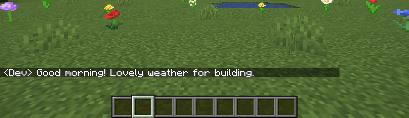
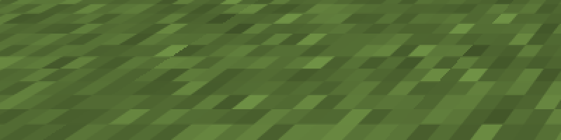
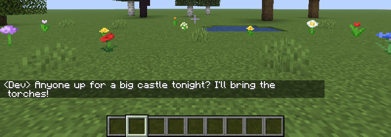

  

<h1>Typing Animation</h1>

<strong>A little motion in every keystroke.</strong> Animated letters. Smooth editing. A cursor that glides.

  
  
  

Make chat, commands, search boxes and other Minecraft text fields feel smoother. Letters animate in and out; once they settle, the text looks exactly like vanilla. Install on your client and use it on any server.

| ✦ Animate | ⇄ Glide | ⚙ Customize |
|:---:|:---:|:---:|
| **11** appear styles · **5** remove styles | Smooth cursor, editing and scrolling | **10** easing curves + Auto |
| Fade, Pop, Wave, Scramble & more | Paste and autocomplete letter by letter | Live preview, Demo and per-field toggles |

  
  
  

### ▸ From the first letter

Type, edit, delete and paste — all in the real Minecraft chat.

### ✦ Find your style

Pop, Scramble, Wave and Drop, paired with different removal effects.

### / Commands, in full colour

Syntax colours stay intact, including when completing a command with <kbd>Tab</kbd>.

---

**Get started:** download the file for your Minecraft version and loader from **Versions**, then put it in `mods`.

**Make it yours:** open **Options → Typing Animation…** for a live preview. Adjust timing, intensity and easing, or toggle chat, other fields and multi-line input separately. [Mod Menu](https://modrinth.com/mod/modmenu) is optional on Fabric.

**Author:** AlexFirst · **Source:** [GitHub — Typing Animation](https://github.com/AlexFirst404/typing-animation).

◇ Versions & compatibility

**Minecraft:** 1.20–1.20.1 · 1.21–1.21.1 · 1.21.4 · 1.21.5 · 1.21.6–1.21.8 · 1.21.9–1.21.10 · 1.21.11 · 26.1–26.1.2 · 26.2 · 26.3.

- **NeoForge 1.20.1:** use the Forge build, tested with NeoForge 47.1.106.
- **Quilt:** tested on 0.30.1 with the Fabric builds for 1.20.1, 1.21.1, 1.21.11 and 26.2. Minecraft 26.3 was tested on 0.31.0-beta.4; Quilt 0.30.1 cannot load it. Other versions are untested on Quilt.
- **Limits:** signs are not animated; books require Minecraft 1.21.6+. Mods that replace the standard text field renderer may conflict.
- **Config:** `config/typinganimation.json`. Interface languages: English and Russian.
- **Modpacks:** welcome — MIT licensed.

🇷🇺 Описание на русском

**Чуть больше движения в каждом нажатии.** Плавный набор в чате, командах, поиске и других полях Minecraft. Символы красиво появляются и исчезают, текст и курсор скользят, а в покое всё выглядит как в ванилле. GIF выше показывают мод в настоящем игровом чате.

- **11 стилей появления, 5 стилей удаления**, 10 кривых плавности и режим «Авто».
- Плавные правки, прокрутка и курсор; посимвольная вставка и автодополнение. Цвета команд сохраняются.
- **Живой предпросмотр и «Демо»** в меню **Настройки → Анимация ввода…**. Настраиваются скорость и интенсивность; чат, остальные поля и многострочный ввод включаются отдельно.

**Установка:** выберите во вкладке **Versions** файл под свою версию игры и загрузчик, положите в `mods`. Мод только клиентский — на сервер устанавливать не нужно. Fabric API не требуется, [Mod Menu](https://modrinth.com/mod/modmenu) — по желанию.

Версии перечислены в блоке **Versions & compatibility** выше. На NeoForge 1.20.1 используйте Forge-сборку. На Quilt проверены только отдельные сборки; для 26.3 нужна протестированная бета 0.31.0-beta.4. Таблички не анимируются, книги поддерживаются с 1.21.6; моды, заменяющие отрисовку поля ввода, могут конфликтовать.

Автор: **AlexFirst**. Конфиг: `config/typinganimation.json`. Лицензия **MIT**, можно включать в сборки.

